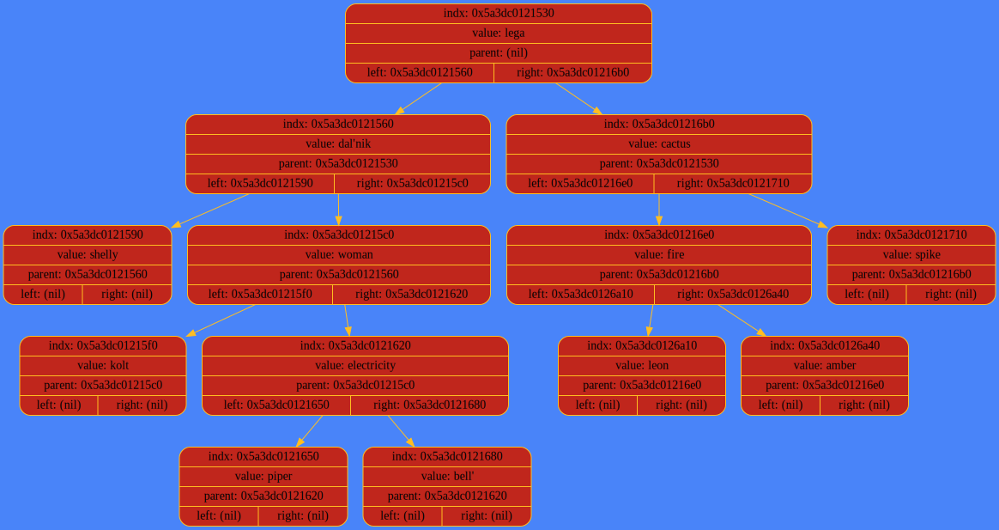

# Игра "Акинатор"

## Введениие

Программа "отгадывает" слова. Для хранения данных используется бинарное дерево.

## Функционал

Акинатор может:
1. Угадать слово, если оно содержится в базе данных
2. Дать определение любому слову из базы данных
3. Сравнить два любых слова из базы данных
4. Если загаданного слова в базе нет, его можно добавить вместе с отличительным признаком и сохранить изменения

Исходное дерево хранится в файле akinator.txt в формате префиксной скобочной записи, например:

```
    (<lega>(<dal'nik>(<shelly> nil  nil )(<woman>(<kolt> nil  nil )(<electricity>(<piper> nil  nil )(<bell'> nil  nil ))))(<cactus>(<fire>(<leon> nil  nil )(<amber> nil  nil ))(<spike> nil  nil )))
```
Пример построенного дерева:



## Скачивание и установка проекта

Для установки программы используются утилиты `make` и `git`.

```CMake
    git clone git@github.com:ksshkh/akinator.git
    make
```
## Запуск программы

Для запуска программы введите
```Bash
    ./akin
```
После этого появится "меню" игры:

```
    hi, let's play the game
    press
    q: for quit
    g: for guess character
    d: for get definition
    c: for compare two characters
    s: for save data
```

Выбирайте режим и следуйте дальнейшим инструкциям!